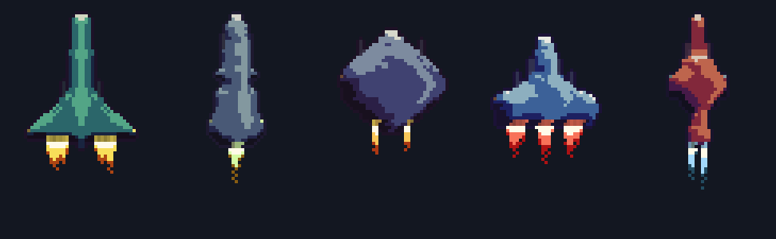
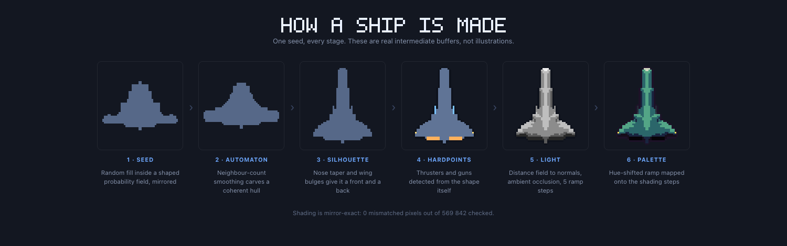
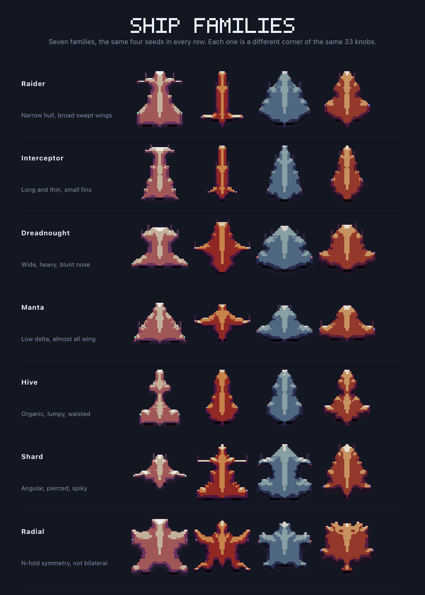
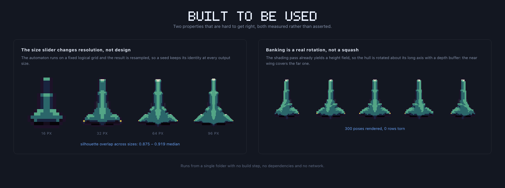

# Pixelship

**[Try it in your browser on itch.io](https://stmn.itch.io/pixelship)**

A free procedural spaceship generator that runs in your browser. It makes top-down pixel-art
spaceship sprites for 2D games and exports them as PNG sprite sheets you can drop straight into
your engine.



Every ship is generated, not drawn. A seed becomes a shaped noise field, a cellular automaton
smooths it into a hull, and the generator works out where the thrusters, guns and lights belong
from the shape itself. You get animated exhaust, throttle and banking frames for turns.



## Live demo

Interactive sprites demonstration: **[stmn.itch.io/pixelship-sprites-demonstration](https://stmn.itch.io/pixelship-sprites-demonstration)**

A small shooter where every ship, colour and animation came out of this generator. It also
doubles as the documentation for the mount-point export: it fires bullets from the ships' actual
gun barrels using exactly the data that export serialises, and the barrels move with the wings
when a ship banks.

## Seven ship families

Interceptors, dreadnoughts, mantas, organic hive craft, angular shards and radially symmetric
alien designs - each one a different region of the same 33 controls. Hit randomize, lock the
ships you like so re-rolls skip them, then tune silhouette, wings, lighting and colour.



## What you get

- **33 live controls** - silhouette, wings, the automaton itself, lighting, hardpoints and
  colour. Every one of them changes the output; there are no decorative sliders.
- **Looping animation** - engine exhaust, throttle, running lights and banking poses. Exported
  strips loop seamlessly by construction.
- **Size independence** - 16 to 96 px, and a seed keeps its design at every size. Prototype
  small, export large.
- **Sprite sheet export** - each row a bank pose, each column an animation frame, plus a fleet
  sheet for a whole squadron in one file.
- **Mount points export** - a small JSON with the gun, thruster and light coordinates for every
  bank pose, in frame-local pixels. Without it you would be measuring twenty numbers per ship by
  hand in an image editor.
- **Draw your own hull** - the first tile in the gallery opens a pixel editor. Sketch a
  silhouette and it gets everything a generated one gets: thrusters and guns detected from the
  shape itself, lighting, palette, banking poses and sprite-sheet export. Mirrored as you draw by
  default, or turn the mirror off for an asymmetric hull, with a live animated preview of the
  finished ship.
- **A saved library** - bookmark a ship and it comes back exactly, because what is stored is the
  recipe, not an image.

Nothing installs, nothing uploads. Your settings and saved ships stay in your browser.



## Using the mount points

The sprite sheet says what a ship looks like; the mount file says where its parts are.
Coordinates are pixels inside one frame, origin at the frame's top-left, and each entry carries
the sheet row it belongs to:

```js
var pose = data.poses[poseRow];              // row in the sheet you are drawing
pose.guns.forEach(function (g) {
  spawnBullet(ship.x + g.x, ship.y + g.y);   // ship.x/y = frame top-left
});
```

That is the whole trick. Engines work the same way for exhaust. If you flip a sprite vertically
for a descending enemy, mirror the mounts too or the bullets come out of the wrong end. The file
itself carries these notes, so you do not have to come back here for them.

## Running it locally

Plain ES5, no build step, no dependencies, no network calls. Opening `index.html` straight off
disk works, but serve the directory instead if you want `localStorage` to behave - browsers treat
`file://` origins inconsistently, and that is where the saved library lives.

```sh
python3 -m http.server 8080
# generator      -> http://localhost:8080/
# sprites demo   -> http://localhost:8080/game/
```

## Project layout

| Path | What lives there |
|---|---|
| `index.html` | The generator: markup, styling and the script tags that assemble it |
| `lab/` | The engine. Headless and DOM-free, so every stage is testable under node |
| `app/` | The browser UI: panel, gallery, hand-drawn hull editor, storage, intro |
| `game/` | The sprites demonstration - a small shooter that consumes the exports |
| `press/` | Promo renders and the itch.io page copy; `lab/press.js` regenerates the renders |
| `build.js` | Assembles `dist/` and `dist-game/` into the itch.io HTML5 bundles |

The pipeline, in `lab/`: `shape.js` (noise field -> cellular automaton -> hull mask) ->
`mounts.js` (thrusters, guns, cockpit and lights read off the shape) -> `shading.js`
(directional lighting, ambient occlusion, rim and spec) -> `palette.js` (hull ramp and outline)
-> `compose.js` (ties them together) -> `bank.js` (turn poses) -> `sprite.js` (frames, strips and
sheet geometry).

## Tests

Each stage has a node test that runs on its own, no framework:

```sh
for t in lab/*.test.js; do node "$t"; done
```

Some of them write comparison renders into `lab/out/` so a change to the shading or palette can
be inspected rather than only asserted.

## Licence

The generator is MIT - see [LICENSE](LICENSE).

**The sprites you make with it are not.** They are released into the public domain under
[CC0 1.0](https://creativecommons.org/publicdomain/zero/1.0/): use them however you like,
including commercially, with no attribution required. No credit needed - but if you ship
something with these sprites in it, a link to your game is always welcome.
